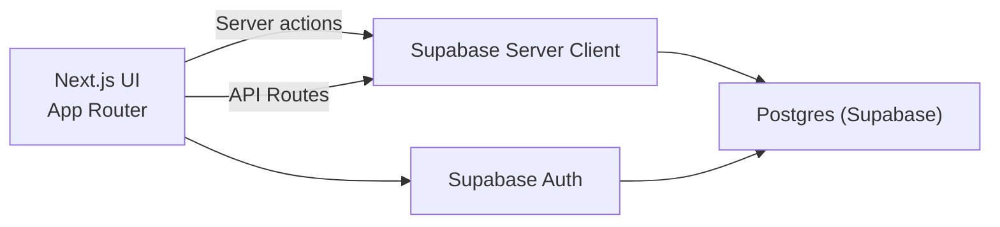

# Expense Tracker Overview

## Architecture
- Frontend: Next.js App Router (React 19, TypeScript, Tailwind CSS)
- Backend: Supabase (Postgres + Auth + RLS)
- Hosting: Vercel (Prod + Preview)
- Storage: Supabase Postgres for expenses, incomes, budgets, categories, purposes, merchants, currencies

### Data Flow
1. User signs in via Supabase Auth (email/password).
2. Server components fetch data via Supabase server client.
3. Client forms submit to server actions (or API routes for CSV export/import).
4. RLS policies enforce per-user access and admin-only catalog writes.

## Schema (Key Tables)

### profiles
- `id` (uuid, pk, auth.user id)
- `email` (text)
- `is_admin` (boolean)
- `created_at` (timestamptz)

### expenses
- `id` (uuid, pk)
- `user_id` (uuid, fk profiles)
- `amount` (numeric)
- `currency` (text)
- `fx_rate_to_dop` (numeric)
- `amount_dop` (numeric)
- `expense_date` (date)
- `category_id` (uuid, fk categories)
- `purpose_id` (uuid, fk purposes)
- `merchant_id` (uuid, fk merchants)
- `notes` (text)

### incomes
- `id` (uuid, pk)
- `user_id` (uuid, fk profiles)
- `amount` (numeric)
- `currency` (text)
- `fx_rate_to_dop` (numeric)
- `amount_dop` (numeric)
- `income_date` (date)
- `source` (text)
- `notes` (text)

### categories
- `id` (uuid, pk)
- `user_id` (uuid, fk profiles, nullable)
- `name` (text)
- `is_system` (boolean)

### purposes
- `id` (uuid, pk)
- `user_id` (uuid, fk profiles, nullable)
- `name` (text)
- `is_system` (boolean)

### merchants
- `id` (uuid, pk)
- `user_id` (uuid, fk profiles)
- `name` (text)

### currencies
- `id` (uuid, pk)
- `code` (text)
- `name` (text)
- `symbol` (text)
- `is_active` (boolean)

### budgets
- `id` (uuid, pk)
- `user_id` (uuid, fk profiles)
- `category_id` (uuid, fk categories)
- `month` (date)
- `amount` (numeric)

## Security (RLS)
- Expenses/Incomes/Budgets: user_id = auth.uid()
- Categories/Merchants/Currencies: admin-only insert/update/delete
- Profiles: admin can read/update; users can read their own

## UX Flow
1. **Register/Login**
   - Email + password
   - Post-registration shows confirmation message
2. **Dashboard**
   - This month spend, income, net
   - Last month spend
   - Top category
   - Budget used + breakdown
   - Trend chart + top merchants
3. **Expenses**
   - Add expense
   - CSV import
   - Filter + pagination + export CSV
4. **Income**
   - Add income
   - Recent list + export CSV
5. **Budgets**
   - Monthly category budgets
6. **Admin (admins only)**
   - Manage user roles (admin/user)
7. **Catalogs (admins only)**
   - Categories, purposes, merchants, currencies

## API Summary
- `GET /api/expenses/export`
- `POST /api/expenses/import`
- `GET /api/incomes/export`
- `POST /api/incomes/import`

OpenAPI spec: `docs/openapi.yaml`
